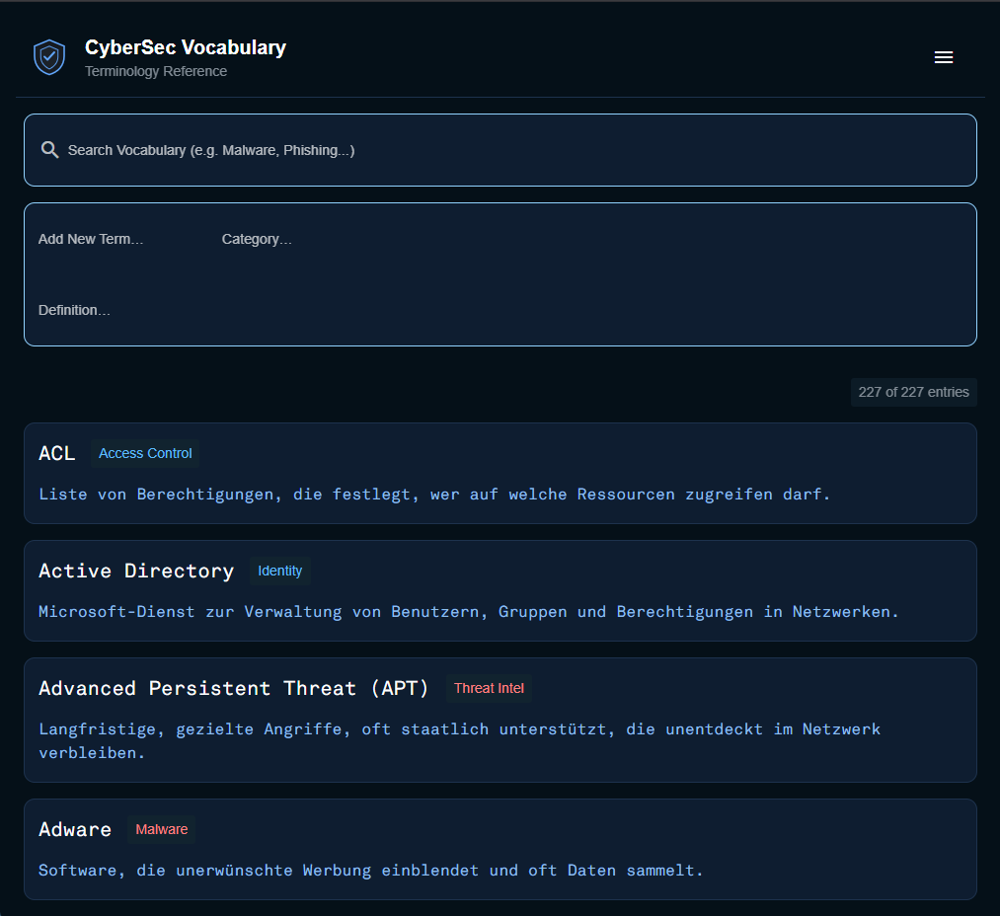

# CyberVocab

A vocabulary-browser frontend with convenient query, update, import and export functionality.
User may call Claude for definitions of terms not contained within the data store. 
Automatically suggests new entries to be added via Google's suggestion API.

# Installation

`pip install -r requirements.txt`
`python3 main.py`

It does not get simpler than this.

For the AI-lookup-feature, just must have an anthropic API key and the environment variable ANTHROPIC_API_KEY must be set accordingly.

# Contributions

The user interface was build using [NiceGUI](https://nicegui.io).
Icons were designed in agentic co-work with Claude.

# License

MIT-License

